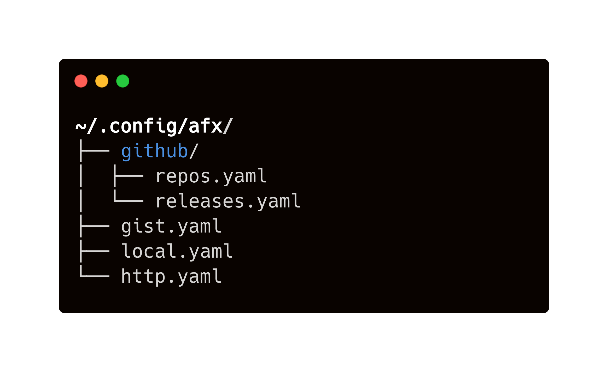

# How it works

## Where to put YAML

<figure>
  
  <figcaption>Example of config directory structure.</figcaption>
</figure>

In afx, all installation declaration can be kept in YAML files. All configurations should be basically saved in `$AFX_CONFIG_PATH`. It defaults to `~/.config/afx`. You can create YAML files that your package declarations are described and save them in this config directory.

In AFX\_CONFIG\_PATH, you can keep files with these rules:

- Naming files as you like is ok
- Having single file can be ok
- Deviding into multiple files is also ok
- Creating sub dir can be also ok

Let's describe each one below.

### Single file

You can create files with any name you like. In above case, declaration of GitHub packages are saved in `github.yaml` and packages of GitHub Releases are saved in `release.yaml`. Others (e.g. `local` etc) are saved in `main.yaml`.

```sh
~/.config/afx
└── afx.yaml
```

It's ok to keep them in one single file. You can choose which one to suit your style.

### Multiple files

You can divide them into each files to make file name and its contents clear and also put it into one YAML file.

```sh
~/.config/afx
├── github.yaml
├── main.yaml
└── release.yaml
```

### Sub directories

Keeping files in sub directories is also ok. afx tries to walk all directories and find files ending with `.yaml` or `.yml`.

```sh
~/.config/afx
├── subdir
│  ├── github-1.yaml
│  └── github-2.yaml
├── local.yaml
└── http.yaml
```

## State feature

<figure>
  
  <figcaption>Example of a state file.</figcaption>
</figure>

afx have a state feature like [Terraform](https://www.terraform.io/). In afx, due to this state feature, what was written in the YAML files means always packages list of what a user desired to install. In short, adding a package declaration to YAML files is to install them to your system and also deleting a package declaration from YAML files is to uninstall from your system.

!!! hint "State in afx"

    All of package declarations are saved in the state file. Install and uninstall will be run by using the difference between YAML files and records in the state file

=== "Install"

    ```diff
      github:
      - name: enhancd
        description: A next-generation cd command with your interactive filter
        owner: b4b4r07
        repo: enhancd
        plugin:
          env:
            ENHANCD_FILTER: fzf --height 25% --reverse --ansi:fzy
          sources:
          - init.sh
    + - name: fzy
    +   description: A better fuzzy finder
    +   owner: jhawthorn
    +   repo: fzy
    +   command:
    +     build:
    +       steps:
    +       - make
    +       - sudo make install
    ```

    After adding package declaration to your YAML, then run this command:

    ```sh
    $ afx install
    ```

=== "Uninstall"

    ```diff
      github:
      - name: enhancd
        description: A next-generation cd command with your interactive filter
        owner: b4b4r07
        repo: enhancd
        plugin:
          env:
            ENHANCD_FILTER: fzf --height 25% --reverse --ansi:fzy
          sources:
          - init.sh
    - - name: fzy
    -   description: A better fuzzy finder
    -   owner: jhawthorn
    -   repo: fzy
    -   command:
    -     build:
    -       steps:
    -       - make
    -       - sudo make install
    ```

    After deleting package declaration from your YAML, then run this command:

    ```sh
    $ afx uninstall
    ```

!!! danger "Localtion of a state file"

    Location of state file defaults to `~/.afx/state.json`. Currently afx does not provide the way to change this path and basically user should not touch this file because it's used internally by afx to keep equivalence between YAML files and its state file. It's likely to be happened unexpected install/uninstall by changing a state file.

## Installation

<figure>
  
  <figcaption>Workflow to install packages.</figcaption>
</figure>

## Initialize your commands/plugins

After installed, basically you need to run `afx init` command and run `source` command with the output of that command in order to become able to use commands and plugins you installed.

```sh
$ source <(afx init)
```

This is just an example of `afx init`. Running `source` command with this output means these statements are evaluate in current shell. So we can use plugins in current shell and also aliases, variables and so on.

```bash
$ afx init
source /Users/babarot/.afx/github.com/b4b4r07/enhancd/init.sh
export ENHANCD_FILTER="fzf --height 25% --reverse --ansi:fzy"
source /Users/babarot/.afx/github.com/zdharma-continuum/history-search-multi-word/history-search-multi-word.plugin.zsh
source /Users/babarot/.afx/github.com/b4b4r07/zsh-vimode-visual/zsh-vimode-visual.zsh
alias diff="colordiff -u"
source /Users/babarot/.afx/github.com/zdharma-continuum/fast-syntax-highlighting/fast-syntax-highlighting.plugin.zsh
source /Users/babarot/.afx/github.com/b4b4r07/zsh-prompt-minimal/minimal.zsh-theme
export PROMPT_PATH_STYLE="minimal"
export PROMPT_USE_VIM_MODE="true"
## package shlide is not installed, so skip to init
source /Users/babarot/.zsh/10_utils.zsh
source /Users/babarot/.zsh/20_keybinds.zsh
source /Users/babarot/.zsh/30_aliases.zsh
source /Users/babarot/.zsh/50_setopt.zsh
source /Users/babarot/.zsh/70_misc.zsh
```

afx initialize step just only generates these statements based on your YAML files.
